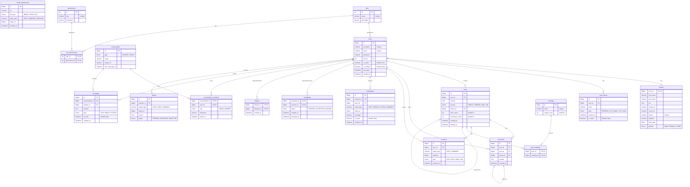

# Database ERD

```mermaid
erDiagram
    users {
        BigInt id PK
        Varchar username "Unique"
        Varchar email "Unique"
        Varchar password
        Int role_id FK
        Boolean is_active "Default: true"
        Boolean is_verified "Default: false"
        Datetime last_login
        Datetime created_at
    }

    profiles {
        BigInt user_id PK,FK
        Varchar first_name
        Varchar last_name
        Text bio
        Varchar avatar_url
        Varchar cover_url
        Varchar phone "Unique"
        Varchar address
        Date birth_date
        Enum gender "MALE, FEMALE, OTHER"
    }

    auth_tokens {
        BigInt id PK
        BigInt user_id FK
        Varchar token
        Enum type "REFRESH, OTP_EMAIL, OTP_PASS"
        Datetime expires_at
        Boolean is_used "Default: false"
    }

    friendships {
        BigInt requester_id PK,FK
        BigInt receiver_id PK,FK
        Enum status "PENDING, ACCEPTED, BLOCKED"
        Datetime created_at
        Datetime accepted_at
    }

    follows {
        BigInt follower_id PK,FK
        BigInt followee_id PK,FK
        Datetime created_at
    }

    posts {
        BigInt id PK
        BigInt user_id FK
        Text content
        Enum privacy "PUBLIC, FRIENDS, ONLY_ME"
        BigInt parent_id FK
        Int likes_count "Default: 0"
        Int comments_count "Default: 0"
        Datetime created_at
        Datetime deleted_at
    }

    comments {
        BigInt id PK
        BigInt post_id FK
        BigInt user_id FK
        BigInt parent_id FK
        Text content
        Datetime created_at
    }

    reactions {
        BigInt id PK
        BigInt user_id FK
        Varchar entity_type "POST, COMMENT"
        BigInt entity_id
        Enum type "LIKE, LOVE, HAHA, SAD"
        Datetime created_at
    }

    media_attachments {
        BigInt id PK
        Varchar url
        Enum file_type "IMAGE, VIDEO, FILE"
        Varchar entity_type "POST, COMMENT, MESSAGE"
        BigInt entity_id
        Datetime created_at
    }

    conversations {
        BigInt id PK
        Enum type "PRIVATE, GROUP"
        Varchar name
        Varchar image_url
        Datetime last_message_at
    }

    conversation_members {
        BigInt conversation_id PK,FK
        BigInt user_id PK,FK
        Enum role "ADMIN, MEMBER"
        Varchar nickname
        Datetime joined_at
    }

    messages {
        BigInt id PK
        BigInt conversation_id FK
        BigInt sender_id FK
        Text content
        Enum type "TEXT, IMAGE, SYSTEM"
        Boolean is_read "Default: false"
        Datetime created_at
    }

    notifications {
        BigInt id PK
        BigInt receiver_id FK
        BigInt actor_id FK
        Varchar entity_type "POST, FRIEND, SYSTEM, COMMENT"
        BigInt entity_id
        Varchar message
        Boolean is_read "Default: false"
        Datetime created_at
    }

    reports {
        BigInt id PK
        BigInt reporter_id FK
        Varchar target_type "POST, USER, COMMENT"
        BigInt target_id
        Text reason
        Enum status "PENDING, RESOLVED, REJECTED"
    }

    roles {
        Int id PK
        Varchar name "Unique"
        Varchar description
    }

    permissions {
        Int id PK
        Varchar slug "Unique"
        Varchar description
    }

    role_permissions {
        Int role_id PK,FK
        Int permission_id PK,FK
    }

    hashtags {
        BigInt id PK
        Varchar name "Unique"
        Int usage_count "Default: 0"
    }

    post_hashtags {
        BigInt post_id PK,FK
        BigInt hashtag_id PK,FK
    }

    %% Relationships
    users ||--|| profiles : "has"
    users ||--o{ auth_tokens : "has"
    users ||--o{ posts : "creates"
    users ||--o{ comments : "writes"
    users ||--o{ reactions : "makes"
    users ||--o{ notifications : "receives"
    users ||--o{ friendships : "requests/receives"
    users ||--o{ follows : "follows/followed"
    users ||--o{ conversation_members : "joins"
    users ||--o{ messages : "sends"
    users ||--o{ reports : "submits"
    roles ||--o{ users : "assigned to"
    
    posts ||--o{ comments : "has"
    posts ||--o{ reactions : "has"
    posts ||--o{ post_hashtags : "tagged with"
    posts ||--o{ posts : "shared from"

    comments ||--o{ comments : "replies to"
    
    conversations ||--o{ conversation_members : "has"
    conversations ||--o{ messages : "contains"
    
    roles ||--o{ role_permissions : "has"
    permissions ||--o{ role_permissions : "belongs to"
    
    hashtags ||--o{ post_hashtags : "used in"
```
