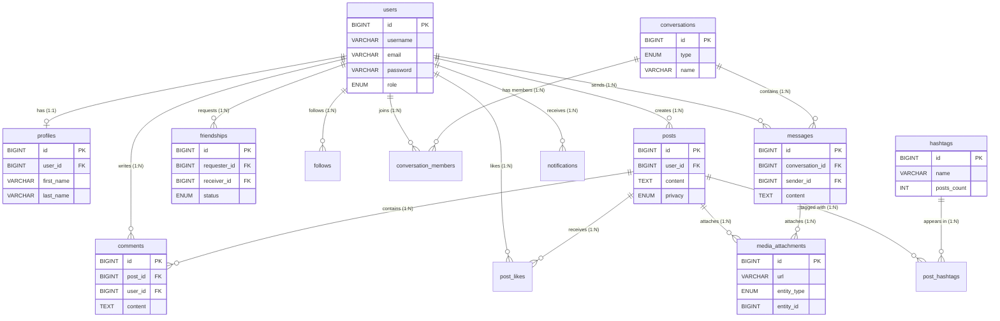

# CHƯƠNG 2. PHÂN TÍCH & THIẾT KẾ

## 2.1 PHÂN TÍCH HỆ THỐNG
### 2.1.1 Đối tượng sử dụng
- **Khách (Guest):** Chỉ có thể vào trang đăng nhập/đăng ký, không thể xem các nội dung bài viết và tương tác của mạng xã hội cho đến khi tạo tài khoản.
- **Người dùng (User):** Sau khi đăng nhập vào nền tảng. Có thể quản lý hồ sơ, đăng bài, tìm kiếm bạn bè, nhắn tin, tương tác với mọi bình luận và những bài đăng khác, cũng như nhận thông báo tức thời.
- **Quản trị viên (Admin):** Có quyền truy cập vào trang Admin Dashboard, sở hữu công cụ chuyên trách để quản lý toàn bộ hệ thống (người dùng, quyền truy cập, nội dung vi phạm dựa trên Report) đảm bảo an toàn, bảo mật và văn minh cho hệ thống mạng lưới.

### 2.1.2 Danh sách chức năng
**A. End-user (Người dùng phổ biến):**
- **Xác thực và Hồ sơ (Auth & Profile):** Đăng ký tài khoản, đăng nhập, lấy lại mật khẩu. Cập nhật ảnh đại diện, ảnh bìa, giới thiệu bản thân (`bio`).
- **Bài viết (Post):** Viết trạng thái, đính kèm file (hình ảnh/video), thêm thẻ Hashtag. Xem bài đăng (New Feed) dạng trang cuộn (Infinite scroll) liên tục.
- **Tương tác Xã hội (Social):** Thích (Like), Bình luận trên bài (Comment). Thích bình luận. Đánh dấu theo dõi (Follow) người khác.
- **Mối quan hệ:** Gửi, chấp nhận/từ chối lời mời Kết bạn (Friendship). Đề xuất kết bạn mới ở cột bên (Sidebar).
- **Nhắn tin (Chat/Messages):** Nhắn tin 1-1, Nhắn tin nhóm (Group chat). Chia sẻ tệp và văn bản, hiện danh sách bạn bè đang trực tuyến.
- **Tìm kiếm & Xu hướng:** Tìm kiếm bạn cài qua trang Search, tìm bài thông qua Hashtags, hiển thị danh sách Trending hashtags phổ biến.
- **Thông báo (Notifications):** Theo dõi tức thời lượt Like, Lời nhắc bình luận và chấp nhận Kết bạn. Cấu trúc cuộn vô hạn cho lịch sử thông báo.
- **Báo cáo xấu:** Chức năng Report cho những bài đăng độc hại tới hội đồng trị sự (Admin).

**B. Admin (Quản trị viên):**
- Đăng nhập bảo mật thông qua tài khoản quản trị và route riêng biệt.
- **Quản lý Tài khoản (User Management):** Liệt kê, tìm kiếm, sửa, khóa (Block/Ban) hoặc đặt lại thông tin người dùng.
- **Quản lý Phân quyền (Role/Permission):** Gán vai trò kiểm duyệt, giới hạn số hành động người trực chiến có thể thực hiện.
- **Quản lý Báo cáo (Report Management):** Xử lý báo cáo bài đăng và xử phạt phù hợp.

### 2.1.3 Đặc tả luồng thao tác (Top 3 chức năng quan trọng)

**1. Tên chức năng: Đăng bài viết (Create Post)**
- **Mục tiêu:** Cho phép người dùng chia sẻ cảm nghĩ, hình ảnh, hoặc các thẻ hastag cùng cộng đồng.
- **Người thực hiện:** Người dùng đã xác thực (User).
- **Dữ liệu vào:** Văn bản (Trạng thái), Tệp tin đa phương tiện, Các hastags có trong nội dung biểu đạt " # ".
- **Dữ liệu ra:** Bài viết được liệt kê trên danh sách bảng tin mới (Feed), hình ảnh lưu vào máy chủ.
- **Luồng chính:** 
  1. Người dùng ấn vào "Đăng bài" (Home).
  2. Modal hiển thị nhập liệu. Người dùng gõ text, chọn ảnh tải lên.
  3. Bấm nút [Đăng]. Form data được gửi qua API (`/api/posts`).
  4. Hệ thống kiểm tra, lưu hình ảnh (Local/S3), quét tìm hashtag để đưa vào database. Gắn liên kết bài đăng với `id` người dùng. 
  5. UI tải lại dòng cấp dữ liệu, bài mới nhất xếp đầu.

**2. Tên chức năng: Thả tim bài viết / Bình luận (Like Post / Comment)**
- **Mục tiêu:** Tính năng cốt lõi kích thích tương tác, lan truyền thông điệp.
- **Người thực hiện:** Mọi tài khoản User.
- **Dữ liệu vào:** Id bài viết (postId) hoặc id Bình Luận (commentId).
- **Dữ liệu ra:** Số lượng Like tăng trong cơ sở dữ liệu (tạo bản ghi trong `post_likes`), Thông báo Realtime cho chủ sỡ hữu bài.
- **Luồng chính:**
  1. Người dùng cuộn dọc danh sách và ấn vào biểu tượng Tim (Like).
  2. Giao diện thay đổi tự động (Tim chuyển sang màu đỏ, số hiện tại +1 - Optimistic UI). 
  3. JS bất đồng bộ gửi Request API lên Backend tới route `/api/posts/{id}/like`.
  4. Hệ thống lưu/xóa tình trạng, nếu vừa thả tim sẽ kích hoạt tạo Job Notification cho chủ bài. 
  
**3. Tên chức năng: Nhắn tin trực tuyến (Group Chat & Messaging)**
- **Mục tiêu:** Liên lạc nội bộ.
- **Luồng chính:**
  1. Vào màn hình /messages, chọn một cá nhân (là bạn bè) hoặc bấm tạo cuộc trò chuyện mới.
  2. Gõ dòng phản hồi và ấn Enter.
  3. Lời thoại gửi lưu vào Database bảng `messages`, cùng thông tin tập tin đa phương tiện nếu có. Màn hình tự cuộn xuống dòng chat mới nhất. 

---

## 2.2 THIẾT KẾ MÀN HÌNH VÀ GIAO DIỆN
### 2.2.1 Sơ đồ Website / Trải nghiệm
- **Nhánh vô danh:** /auth/login → /auth/register → /auth/forgot-password.
- **Nhánh đã xác thực (Protected App):** 
  - Trang chủ (Home Feed): Cuộn trang, đăng bài, nhìn danh sách bạn bè, cột Hashtag xu hướng.
  - Trang cá nhân (Profile): Quản lý bài bản thân, ảnh bìa, avatar.
  - Trang bạn bè (Friends): Xem lời mời đến, tìm bạn mới.
  - Trò chuyện (Messages): Giao diện 2 cột với box danh bạ và box chat.
  - Trang Thông Báo (Notifications): Chuông báo phía trên Navbar.
- **Nhánh Admin:** /admin → /admin/users → /admin/reports.

### 2.2.2 Danh sách màn hình (Screen Listing)
| Mã | Tên màn hình | Đối tượng | Mô tả ngắn |
|-|-|-|-|
| SCR_01 | **Login/Register** | Guest | Màn hình đầu vào để xác thực danh tính. |
| SCR_02 | **Home Feed** | User | Quản lý bảng tin bài đăng từ bạn bè và đang theo dõi. |
| SCR_03 | **Profile Page** | User | Màn hình trang cá nhân tổng hợp thông tin sinh trắc học và tường nhà. |
| SCR_04 | **Messages UI** | User | Hệ thống liên lạc gồm các inbox, hỗ trợ đa phương tiện. |
| SCR_05 | **Admin Dashboard** | Admin | Trạm kiểm soát truy cập và quản lý hệ thống. |

### 2.2.3 Bản xem trước giao diện (GUI Screenshots)
*(Sinh viên tự đính kèm hình ảnh screenshot dự án)*
> **Chú thích hướng dẫn:** Thêm các hình ảnh màn hình Login, News Feed (Hiển thị được màu sắc chủ đạo, cách các nút tương tác, thanh điều hướng Navbar và Sidebar trái phải, cũng như màn hình chat để thấy rõ tính thẩm mỹ cao của React&Tailwind).*

---

## 2.3 THIẾT KẾ CƠ SỞ DỮ LIỆU

### 2.3.1 Mô hình ERD (Entity Relationship Diagram)
> *Sinh viên chụp ảnh màn hình từ draw.io hoặc MySQL Workbench và nhúng vào đây.*

### 2.3.2 Lược đồ cơ sở dữ liệu RDM (Relational Data Model)
Dưới đây là sơ đồ quan hệ các thực thể và cấu trúc liên kết (RDM) của hệ thống được biểu diễn tự động:

### 2.3.3 Data Dictionary (Từ điển dữ liệu)
Dưới đây là đặc tả chi tiết một vài bảng quan trọng nhất trong hệ thống:

**1. Bảng `users` (Quản lý tài khoản đăng nhập)**
- **Mục đích:** Lưu trữ thông tin đăng nhập và danh tính định danh gốc của mỗi cá nhân trên nền tảng.
- **Các cột:**
  - `id` (BIGINT, PK, Auto Increment): Mã người dùng duy nhất.
  - `username` (VARCHAR 255, Unique, Not Null): Tên hiển thị định danh dùng trong @mention.
  - `email` (VARCHAR 255, Unique, Not Null): Địa chỉ hòm thư dùng đăng nhập & lấy lại mật khẩu.
  - `password` (VARCHAR 255, Not Null): Mật khẩu đã được mã hóa (Hash).
  - `role` (ENUM('user', 'admin'), Default 'user'): Quyền hạn truy cập.
  - `deleted_at` (TIMESTAMP, Nullable): Đánh dấu thời gian xóa mềm tài khoản.
- **Index:** `users_email_unique`, `users_username_unique`.
- **Dữ liệu mẫu:** `(1, 'nguyenvana', 'vana@gmail.com', '$2y$10$...', 'user', null)`.

**2. Bảng `posts` (Quản lý bài viết/Trạng thái)**
- **Mục đích:** Lưu trữ dữ liệu dòng thời gian chia sẻ của người dùng. Tương đương với Catalog trong thương mại điện tử nhưng áp dụng cho hệ nội dung mạng xã hội.
- **Các cột:**
  - `id` (BIGINT, PK, Auto Increment): Mã dòng trạng thái.
  - `user_id` (BIGINT, FK -> users.id, Index): Khóa ngoại xác định ai đăng bài.
  - `content` (TEXT, Nullable): Nội dung chữ viết chia sẻ.
  - `privacy` (ENUM('PUBLIC', 'FRIENDS', 'ONLY_ME')): Chế độ xem.
  - `parent_id` (BIGINT, Nullable, FK -> posts.id): Nếu là bài Share, đây sẽ trích dẫn về bài gốc.
  - `created_at` (TIMESTAMP): Thời điểm đăng để phục vụ News Feed Sort.
- **Ràng buộc:** `FOREIGN KEY (user_id) REFERENCES users(id) ON DELETE CASCADE`.
- **Dữ liệu mẫu:** `(15, 1, 'Hôm nay trời đẹp quá!', 'PUBLIC', NULL, '2023-11-20 10:00')`.

**3. Bảng `friendships` (Quản lý mối quan hệ kết bạn)**
- **Mục đích:** Quản lý trạng thái xin kết bạn và bạn bè đã đồng ý giữa hai user_id.
- **Các cột:**
  - `id` (BIGINT, PK, Auto Increment).
  - `requester_id` (BIGINT, FK -> users.id): Mã người gửi lời mời.
  - `receiver_id` (BIGINT, FK -> users.id): Mã người nhận lời mời.
  - `status` (ENUM('PENDING', 'ACCEPTED', 'DECLINED')): Tình trạng quan hệ.
- **Ràng buộc:** Cặp (`requester_id`, `receiver_id`) phải lưu trữ UNIQUE để không gửi lời mời lặp.

**4. Bảng `profiles` (Hồ sơ mở rộng)**
- **Mục đích:** Tách biệt thông tin cá nhân khỏi bảng `users` để tối ưu truy xuất xác thực, chuyên lưu trữ thông tin sinh trắc học và ảnh đại diện.
- **Các cột:**
  - `id` (BIGINT, PK, Auto Increment).
  - `user_id` (BIGINT, FK -> users.id, Unique): Mã người dùng sở hữu hồ sơ.
  - `first_name`, `last_name` (VARCHAR 255, Nullable): Họ và tên đầy đủ.
  - `bio` (TEXT, Nullable): Đoạn giới thiệu ngắn gọn của chủ tài khoản.
  - `avatar_url` (VARCHAR 255, Nullable): Đường dẫn tĩnh tới ảnh đại diện.
  - `cover_url` (VARCHAR 255, Nullable): Đường dẫn tĩnh tới ảnh bìa trang cá nhân.
- **Ràng buộc:** `FOREIGN KEY (user_id) REFERENCES users(id) ON DELETE CASCADE`. Do đây là quan hệ 1-1 nên có thuộc tính Unique.
- **Dữ liệu mẫu:** `(1, 1, 'Văn A', 'Nguyễn', 'Hello World', 'https://...', 'https://...')`.

**5. Bảng `comments` (Bình luận)**
- **Mục đích:** Lưu trữ các luồng thảo luận, phản hồi gắn liền dưới mỗi bảng cập nhật trạng thái bài viết.
- **Các cột:**
  - `id` (BIGINT, PK, Auto Increment).
  - `post_id` (BIGINT, FK -> posts.id): Bình luận thuộc về bài viết nào.
  - `user_id` (BIGINT, FK -> users.id): Mã ID của người viết bình luận.
  - `content` (TEXT, Not Null): Nội dung văn bản của bình luận.
  - `parent_id` (BIGINT, FK -> comments.id, Nullable): Dùng để xác định đây là bình luận gốc (NULL) hay là một câu trả lời cho comment khác (Reply).
  - `created_at` (TIMESTAMP): Thời gian gửi bình luận để sắp xếp UI.
- **Ràng buộc:** Xóa bài viết (`DELETE CASCADE` trên khóa ngoại `post_id`) thì toàn bộ nhánh Comment con bốc hơi theo. 
- **Dữ liệu mẫu:** `(10, 15, 2, 'Tuyệt vời quá!', NULL, '2023-11-20 10:05')`.

**6. Bảng `post_likes` / `comment_likes` (Tương tác Thích)**
- **Mục đích:** Ghi nhận thông tin người dùng nào đã thích (tim) mục tiêu nào nhằm chuyển trạng thái "Đã thích" màu đỏ và cộng điểm tương tác số lượng.
- **Các cột (`post_likes`):**
  - `id` (BIGINT, PK, Auto Increment).
  - `post_id` (BIGINT, FK -> posts.id): Bài được thích.
  - `user_id` (BIGINT, FK -> users.id): Người bấm nút.
- **Ràng buộc:** Thiết lập Index bộ `UNIQUE KEY (post_id, user_id)` để ngăn chặn tình trạng một tài khoản có thủ thuật spam API gọi Like nhiều lần trên cùng 1 bài.
- **Dữ liệu mẫu:** `(1, 15, 3)` (User 3 thích post 15).

**7. Bảng `media_attachments` (Tệp đính kèm)**
- **Mục đích:** Cơ sở dữ liệu đa hình (Polymorphic Pattern) linh hoạt xử lý cất giữ tài nguyên ảnh/video/tệp cho nhiều nơi khác nhau mà không cần tạo bảng cồng kềnh phụ thuộc.
- **Các cột:**
  - `id` (BIGINT, PK, Auto Increment).
  - `url` (VARCHAR 255, Not Null): Link lưu ở server ngoài/S3.
  - `file_type` (ENUM('IMAGE', 'VIDEO', 'FILE')): Phân loại đuôi mở rộng dạng tệp.
  - `entity_type` (ENUM('POST', 'MESSAGE', 'COMMENT')): Định danh loại thực thể mà file này thuộc về.
  - `entity_id` (BIGINT, Not Null): Đoạn nối tới Mã số (id) của bài đăng hoặc đoạn chat cụ thể.
- **Index:** Đánh index phức hợp bộ (`entity_type`, `entity_id`) để truy xuất khối lượng hình đính kèm thuộc 1 bài trong O(1).

**8. Bảng `hashtags` & `post_hashtags` (Hệ thống thẻ phân loại)**
- **Mục đích:** `hashtags` kho lưu các từ khóa gốc chung để tính toán xếp hạng Trending. `post_hashtags` là bảng nối trung gian (Pivot Table) giải quyết quan hệ Many-to-Many giữa dòng trạng thái - thẻ.
- **Các cột `hashtags`:**
  - `id` (BIGINT, PK, Auto Increment).
  - `name` (VARCHAR 255, Unique, Not Null): Tên thẻ thuần chữ (VD: `#Astra`).
  - `posts_count` (INT, Default 0): Điểm đếm cache số thứ tự lượt nhắc tới thẻ.
- **Index:** Lập Index cho trường `name` kích tốc độ autocomplete API khung search lên siêu tốc.
- **Dữ liệu mẫu (`post_hashtags`):** `(post_id: 15, hashtag_id: 8)`.

**9. Bảng `conversations` & `conversation_members` (Hộp thoại Chat)**
- **Mục đích:** Định tuyến cấu trúc liên kết cho hệ thống phòng trò chuyện trực tuyến. Rẽ nhánh rạch ròi Chat cá nhân hoặc Phòng Lớn.
- **Các cột `conversations`:**
  - `id` (BIGINT, PK, Auto).
  - `type` (ENUM('DIRECT', 'GROUP'), Default 'DIRECT'): Kiểu buồng chat.
  - `name` (VARCHAR 255, Nullable): Tiêu đề hiển thị, nếu là group tập thể.
- **Các cột `conversation_members`:**
  - `id`(PK), `conversation_id` (FK), `user_id` (FK), `role` (ENUM('admin', 'member')).

**10. Bảng `messages` (Nội dung tin nhắn)**
- **Mục đích:** Dòng chảy đàm thoại thu gọn toàn bộ các bong bóng trò chuyện phát sinh trong 1 máy phòng.
- **Các cột:**
  - `id` (BIGINT, PK, Auto Increment).
  - `conversation_id` (BIGINT, FK -> conversations.id): Lời thoại này đổ vào box nào.
  - `sender_id` (BIGINT, FK -> users.id): Người gõ chữ, gửi đi.
  - `content` (TEXT, Nullable): Đoạn chat văn bản trống nếu chỉ gửi file.
  - `is_read` (BOOLEAN, Default false): Trạng thái Đã xem để đánh dấu Active check.
  - `created_at` (TIMESTAMP).
- **Index:** Thêm chỉ mục trên `conversation_id` sắp xếp theo `created_at DESC` để tính năng Infinite Scroll (Kéo thả vuốt tay xem tin cũ) không bị Delay truy vấn nặng.

**11. Bảng `notifications` (Hệ thống Thông báo chuông)**
- **Mục đích:** Nút giao thông luồng để đẩy chuông Notification Notification System theo dạng Polling Database.
- **Các cột:**
  - `id` (BIGINT, PK, Auto Increment).
  - `receiver_id` (BIGINT, FK -> users.id): Tài khoản đích (Ai sẽ thấy thông báo).
  - `actor_id` (BIGINT, FK -> users.id): Căn nguyên gây ra hoạt động đó (Nhân vật thả tim).
  - `entity_type` (VARCHAR 50): Chuẩn loại sự cố ('POST', 'COMMENT', 'FRIEND_REQUEST').
  - `entity_id` (BIGINT): Trỏ ID thẳng vào Entity gốc ở bảng tương ứng.
  - `message` (TEXT): Đoạn tóm tắt báo "A vừa thích ảnh của bạn".
  - `is_read` (BOOLEAN, Default false).
- **Dữ liệu mẫu:** `(1, 2, 5, 'POST', 15, 'Tuấn A đã thích bài viết của bạn', 'false')`.

**12. Bảng `follows` (Mạng lưới Người theo dõi)**
- **Mục đích:** Chức năng đăng ký kênh nhận dòng sự kiện mạng (Subscriber) tuyến tính chỉ lưu chiều quan tâm một hướng (Không như Kết Bạn hai bên phải đồng thuận nhận chung).
- **Các cột:**
  - `id` (BIGINT, PK, Auto Increment).
  - `follower_id` (BIGINT, FK -> users.id): Người chủ động xin được nhấn Flow.
  - `followed_id` (BIGINT, FK -> users.id): Vĩ nhân/Idol cấp trang cập nhật.
- **Ràng buộc:** Đặt Index kết hợp (`follower_id`, `followed_id`) đồng hóa ràng buộc UNIQUE để cấm user chạy bot ấn Follow đôi với cùng đối tượng 2 lần vào Table gán tải máy chủ.

### 2.3.4 Quy tắc dữ liệu quan trọng
- **Quy tắc ẩn/xóa bài viết (Soft-delete vs Hard-delete):** 
  Thay vì xóa vật lý khỏi CSDL và làm gãy hệ thống cây bình luận khổng lồ đính kèm, hệ thống dùng cơ chế **Soft Delete** (`deleted_at`). Khi admin khóa bài hoặc người dùng tự xóa bài, bài viết sẽ lưu dấu thời gian vào trường `deleted_at`. Lớp Repository/Eloquent sẽ tự động lọc ra bằng mệnh đề `WHERE deleted_at IS NULL` trên bảng tin.
- **Quy tắc đính kèm HashTag và Cập nhật Trending:** 
  Khi có bài đăng mới, hệ thống trích xuất chuỗi mã `#`, kiểm tra bảng `hashtags`. Nếu có sẵn thì tăng điểm `posts_count += 1`. Nếu chưa có thì Insert. Quá trình tính độ "Nóng" liên kết qua bảng trung gian `post_hashtags`. (Tương quan giống nhập hàng FIFO/LIFO nhưng tối ưu thành tính điểm Trend theo thời gian 7 ngày sát nhất).
- **Quy tắc tạo Chat Nhóm (Conversation Transaction):** 
  Việc tạo phòng Chat 1-1 hay nhóm Group yêu cầu 1 lệnh Transaction từ CSDL do dính đến nhiều bước. *Bước 1:* Thêm dòng vào bảng `conversations`. *Bước 2:* Dùng ID sinh ra để thêm người tham gia vào `conversation_members`. Nếu một trong hai lỗi (do id giả), lệnh sẽ Rollback hoàn thành chống dữ liệu rác phòng chat rỗng đọng lại trong máy chủ.

### 2.3.5 Cài đặt CSDL
- **Công cụ System:** MySQL Server (Ver 8.x) hoặc MariaDB chạy độc lập hoặc qua Docker Container.
- **Charset & Collation:** Sử dụng chuẩn `utf8mb4_unicode_ci` để tương thích hoàn toàn việc lưu trữ các ký tự đa ngôn ngữ, tiếng Việt, và đặc biệt là bộ Icon **Emojis** phong phú do User viết trong nội dung.
- **Cơ chế triển khai (Migration):** CSDL không được khởi chạy qua việc Dump file .sql truyền thống, mà chạy hoàn toàn thông qua tính năng `php artisan migrate` bảo toàn version control tự động từ các file script PHP có sẵn trong thư mục `database/migrations`.

---

## 2.4 THIẾT KẾ XỬ LÝ & CẤU TRÚC SOURCE

### 2.4.1 Kiến trúc thư mục & quy ước code
Hệ thống được chia thành 2 phần độc lập (Backend và Frontend), giao tiếp qua RESTful API.

**A. Kiến trúc thư mục:**
- **/backend/config**: Cấu hình cơ sở dữ liệu, cors, xác thực, file hệ thống.
- **/backend/app/Models**: Định nghĩa các thực thể CSDL (User, Post, Comment...).
- **/backend/app/Http/Controllers**: Xử lý logic nghiệp vụ và điều phối dữ liệu (PostController, AuthController).
- **/frontend/src/assets**: Chứa tài nguyên tĩnh như hình ảnh, biểu tượng.
- **/frontend/src/pages/Admin**: Giao diện và logic dành riêng cho Quản trị viên (Dashboards, Users, Reports).
- **/frontend/public**: Các tài nguyên công khai, file index.html.

**B. Quy ước đặt tên:**
- **File & Class (Backend):** Sử dụng `PascalCase` cho Controller và Model (VD: `UserController.php`, `PostLike.php`).
- **Hàm xử lý / Biến:** Sử dụng `camelCase` (VD: `getTrendingHashtags()`, `isLiked`).
- **File (Frontend):** Sử dụng `PascalCase` cho các component React (VD: `PostList.tsx`) và `kebab-case` cho URL/Routing.
- **Bảng CSDL:** Sử dụng số nhiều, chữ thường và dấu gạch dưới `snake_case` (VD: `users`, `post_likes`, `media_attachments`).

**C. Tổ chức code tự viết và thư viện:**
- **Code tự viết:** Đặt trong cẩu trúc `/backend/app` (cho logic API) và `/frontend/src` (cho logic UI).
- **Thư viện Open-source/Framework:** Laravel quản lý qua Composer tại thư mục `/backend/vendor`. React quản lý qua npm tại thư mục `/frontend/node_modules`.

### 2.4.2 Thiết kế module
Vì đây là mạng xã hội, các module được đối chiếu và chuyển đổi từ mô hình tiêu chuẩn để phù hợp với ngữ cảnh:

- **Auth:** Quản lý quy trình đăng ký, đăng nhập bằng JWT (JSON Web Token), đăng xuất, lấy lại mật khẩu và thiết lập hồ sơ người dùng ban đầu.
- **Posts (Thay thế Catalog):** Quản lý phân loại nội dung, hiển thị danh sách bài viết (News Feed) với thuật toán phân phối, chi tiết bài đăng, tìm kiếm người dùng/hashtag, và thuật toán phân trang cuộn vô hạn (Infinite Scroll).
- **Social Interactions (Thay thế Cart/Checkout):** Quản lý các hành động tạo ra dữ liệu liên kết như: "Thả tim" (Like) bài viết/bình luận, theo dõi (Follow) người khác, và quản lý các mối quan hệ bạn bè (Friendships).
- **Messages & Notifications (Thay thế Orders):** Theo dõi lịch sử liên lạc, trạng thái hộp thư (chat 1-1, chat nhóm), và hệ thống thông báo thời gian thực về tất cả tương tác cá nhân.
- **Admin:** Quản lý trung tâm dành cho người quản trị (User management, Post management), theo dõi số lượng bài đăng, xử lý đơn tố cáo (Report management), và xem báo cáo tương tác/hoạt động.

### 2.4.3 Các truy vấn SQL tiêu biểu
Dưới đây là 10 truy vấn cơ sở dữ liệu tiêu biểu, thể hiện logic cốt lõi của hệ thống mạng xã hội:

**1. Truy vấn phân trang danh sách bài viết (News Feed)**
- **Mục đích:** Lấy danh sách bài viết theo thứ tự thời gian cho trang chủ, kết hợp thông tin người đăng và phân trang.
- **Input:** `limit` (số lượng), `offset` (trang).
- **Output:** Danh sách bài viết và tổng số trang.
*(Code Eloquent/SQL mẫu: `SELECT * FROM posts ORDER BY created_at DESC LIMIT 10 OFFSET 0`)*

**2. Truy vấn tìm kiếm nội dung (Có điều kiện)**
- **Mục đích:** Tìm kiếm bài viết chứa từ khóa xác định hoặc gắn hashtag cụ thể.
- **Input:** Khóa tìm kiếm (`keyword`).
- **Output:** Các bài đăng thỏa mãn điều kiện `LIKE %keyword%`.

**3. Tạo bài viết và đính kèm (Transaction)**
- **Mục đích:** Đảm bảo tính toàn vẹn dữ liệu khi tạo bài đăng. Chỉ lưu bài viết nếu việc lưu URL hình ảnh đính kèm thành công.
- **Input:** Thông tin văn bản, mảng URL hình ảnh.
- **Output:** Trạng thái thành công/thất bại toàn bộ (Commit / Rollback).

**4. Toggle Like (Thích/Bỏ thích bài viết)**
- **Mục đích:** Thêm hoặc xóa bản ghi trong bảng `post_likes` để cập nhật lượt thích.
- **Input:** `user_id`, `post_id`.
- **Output:** Trạng thái liked mới và tổng số lượt thích.

**5. Lấy danh sách Trending Hashtags**
- **Mục đích:** Thống kê và xếp hạng các chủ đề phổ biến.
- **Input:** Khoảng thời gian (ví dụ: 7 ngày qua).
- **Output:** Danh sách hashtag sắp xếp giảm dần theo số lượng bài viết (`ORDER BY posts_count DESC LIMIT 10`).

**6. Truy vấn chuỗi tin nhắn hội thoại (Chat History)**
- **Mục đích:** Lấy lịch sử tin nhắn của một Group/Chat 1-1 theo thứ tự từ cũ đến mới để hiển thị.
- **Input:** `conversation_id`, `offset/limit`.
- **Output:** Danh sách messages thuộc về luồng hội thoại.

**7. Tạo tài khoản User (Transaction)**
- **Mục đích:** Lưu thông tin gốc vào `users` và hồ sơ mở rộng bản ghi tương ứng vào bảng `profiles`.
- **Input:** Name, Email, Password.
- **Output:** Token đăng nhập và Entity của người dùng.

**8. Lặp và lấy danh sách Bạn bè (Friendships)**
- **Mục đích:** Lọc ra những người mà user đã kết bạn (Trạng thái accepted) làm sổ địa chỉ.
- **Input:** `current_user_id`.
- **Output:** Danh sách bạn bè.

**9. Báo cáo thống kê số lượng bài đăng (Cho Admin)**
- **Mục đích:** Đếm số lượng bài viết tạo ra theo từng ngày trong 7 ngày gần nhất để vẽ biểu đồ biểu diễn.
- **Input:** Số lượng ngày thống kê (`days`).
- **Output:** Collection cặp dữ liệu (`date` - `total_posts`).

**10. Truy vấn thống kê thông báo chưa đọc (Unread Notifications)**
- **Mục đích:** Đếm số chấm đỏ chuông thông báo để nhắc nhở người dùng theo dõi.
- **Input:** `receiver_id`.
- **Output:** Kiểu số đếm nguyên (`COUNT(*) WHERE is_read = false`).
